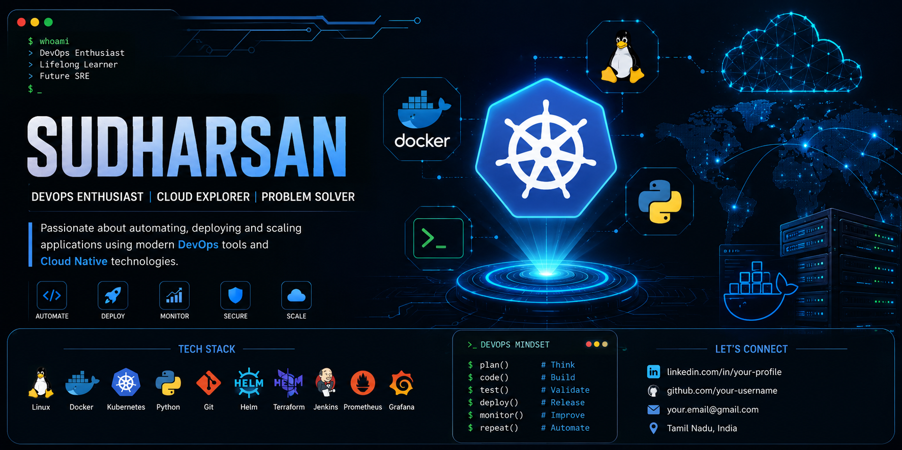

<div align="center">

# Hi 👋 I'm Sudharsan S

### 🎓 B.E Electronics & Communication Engineering (ECE)

### ☸️ DevOps Enthusiast • 🐳 Docker • ☁️ Cloud Computing • 🐧 Linux • 🐍 Python



</div>

---

## 🚀 About Me

🎓 Electronics & Communication Engineering Student

💻 Passionate about DevOps, Cloud Computing and Automation

☸️ Learning Kubernetes & Cloud-Native Technologies

🐳 Building and Managing Containerized Applications

🐧 Linux Enthusiast

🐍 Python Developer

📡 Interested in IoT, Cloud Infrastructure and System Administration

---

## 🛠️ Tech Stack

### DevOps & Cloud


### Programming


### Operating Systems


### IoT & Backend


---

## 🎯 Current Learning Path

```text
Linux Administration
        ↓
Docker
        ↓
Kubernetes
        ↓
CI/CD
        ↓
Cloud Computing
        ↓
DevOps Engineering
```

---

## 🚨 Featured Projects

### Gas Leakage Detection System

✔ Arduino UNO

✔ NodeMCU ESP8266

✔ Firebase Realtime Database

✔ Machine Learning Anomaly Detection

✔ Twilio SMS Alert Integration

---

### Kubernetes Labs

✔ Pods

✔ ReplicaSets

✔ Deployments

✔ Services

✔ ConfigMaps

✔ Secrets

✔ Persistent Volumes

✔ StatefulSets

✔ DaemonSets

---

### Docker Projects

✔ Docker Images

✔ Docker Compose

✔ Container Networking

✔ Multi-Container Applications

---

## 📊 GitHub Statistics


---

## 🔥 Contribution Streak


---

## 🏆 2026 Goals

* ☸️ Master Kubernetes Administration
* 🐳 Build Advanced Docker Projects
* ☁️ Learn AWS Cloud Services
* 🚀 Create Production-Level DevOps Projects
* 📖 Contribute to Open Source
* 🎯 Secure a DevOps / Cloud Engineering Role

---

## 📫 Connect With Me

* GitHub: github.com/ssudharsan984
* LinkedIn: Add Your LinkedIn Profile
* Email: Add Your Email

---

<div align="center">

### ⭐ Thanks for visiting my profile ⭐

Building Cloud-Native Solutions with Kubernetes & Docker 🚀

</div>
